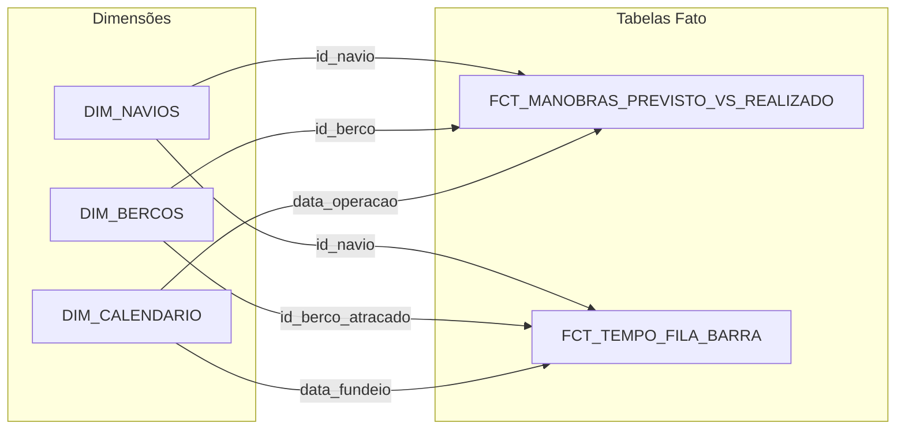

# Catálogo e Dicionário de Dados - Marítimo Data Pipeline

Este documento é a referência oficial da modelagem e arquitetura de dados do pipeline marítimo, detalhando os esquemas, tipos de dados, regras de negócio, linhagem e a especificação completa da camada analítica (BI) abrangendo as camadas **Silver**, **Gold** e o **Dashboard**.

---

## Glossário de Siglas e Termos Marítimos
* **ATB (*Actual Time of Berthing*):** Horário real em que a embarcação atracou no berço.
* **ATS (*Actual Time of Sailing*):** Horário real em que a embarcação desatracou e zarpou.
* **ETS (*Estimated Time of Sailing*):** Previsão estimada de saída do navio.
* **BB (*Bombordo*):** Lado esquerdo da embarcação (em relação à proa/frente).
* **BE (*Boreste*):** Lado direito da embarcação (em relação à proa/frente).
* **LOA (*Length Overall*):** Comprimento total do navio, de proa a popa (em metros/centímetros).
* **BOCA (*Beam*):** Largura máxima da embarcação (em centímetros/metros).
* **CALADO (*Draft*):** Distância vertical entre a linha de flutuação e a quilha (fundo) do navio.
* **EK (*Even Keel*):** Calado nivelado (calado de proa igual ao de popa).
* **TBC (*To Be Confirmed*):** Informação ainda a ser confirmada pelo armador/praticagem (muito comum em eventos climáticos/barra fechada).

---

# PARTE 1: CAMADA SILVER (Snapshots Tratados)

## Informações Gerais da Camada Silver
* **Formato de Armazenamento:** Apache Parquet
* **Frequência de Extração:** 4 vezes ao dia (aproximadamente às 07h, 12h, 16h e 18h).
* **Padrão de Nomenclatura dos Arquivos:** `YYYY-MM-DD_HH-MM-SS.parquet`
* **Metadados de Linhagem (Audit Columns) presentes em todas as tabelas:**
  * `data_processamento` (`datetime64[us]`): Timestamp exato em que o arquivo foi transformado pelo script `transform_silver.py`.
  * `arquivo_origem` (`string`): Nome do arquivo HTML bruto na `landing_raw` de onde o dado se originou.
  * `snapshot_timestamp` (`datetime64[us]`): Timestamp do snapshot extraído do nome do arquivo.

---

### 1.1 Tabela Silver: `manobras_previstas`
* **Descrição:** Registra a programação e status das manobras de entrada, saída e movimentação de navios previstas para os berços.
* **Granularidade:** Uma linha por manobra programada em um snapshot específico.

| Coluna | Tipo Pandas | Tipo Parquet | Nulo? | Descrição | Exemplo / Regras |
| :--- | :--- | :--- | :--- | :--- | :--- |
| `data` | `datetime64[us]` | `TIMESTAMP` | Não | Data da manobra | `2026-08-27` |
| `horario` | `string` | `STRING` | Não | Texto original do horário e status | `"16:45 atb"`, `"tbc"` |
| `manobra` | `string` | `STRING` | Não | Tipo da operação prevista | `"entrada"`, `"saida"`, `"remocao"` |
| `berco` | `string` | `STRING` | Não | Berço de destino/origem da atracação | `"pnave 02"`, `"jbs 1"` |
| `bordo` | `string` | `STRING` | Sim | Lado do navio atracado ao cais | `"bb"` (bombordo), `"be"` (boreste) |
| `navio` | `string` | `STRING` | Não | Nome do navio normalizado | `"cosco shipping mexico"` |
| `rota` | `string` | `STRING` | Sim | Rota/Bacia de evolução utilizada | `"bacia 1"`, `"bacia 2"` |
| `loa` | `Int64` | `INT64` | Sim | Comprimento total da embarcação (*LOA*) | `33590` |
| `boca` | `Int64` | `INT64` | Sim | Largura máxima da embarcação (*Beam*) | `5100` |
| `calado` | `string` | `STRING` | Sim | Medida do calado na manobra | `"11,20 ek"`, `"9,15/10,50"` |
| `situacao` | `string` | `STRING` | Sim | Situação operacional do navio | `"no canal"`, `"atracado"`, `"fundeado"`, `"drifting"` |
| `hora` | `string` | `STRING` | Sim | Horário previsto isolado (HH:MM) | `"16:45"`, `<NA>` quando TBC |
| `status` | `string` | `STRING` | Sim | Sigla do status operacional | `"atb"`, `"ets"`, `"ats"`, `"tbc"` |
| `data_hora_manobra_prevista` | `datetime64[us]` | `TIMESTAMP` | Sim | Timestamp unificado (`data + hora`) | `2026-08-27 16:45:00`, `NaT` quando TBC |
| `data_processamento` | `datetime64[us]` | `TIMESTAMP` | Não | Timestamp de ingestão/transformação | `2026-08-27 22:51:35` |
| `arquivo_origem` | `string` | `STRING` | Não | Arquivo HTML de origem | `"2026-08-27_18-00-06_manobras_previstas.html"` |
| `snapshot_timestamp` | `datetime64[us]` | `TIMESTAMP` | Não | Data/hora do snapshot extraído | `2026-08-27 18:00:06` |

---

### 1.2 Tabela Silver: `manobras_realizadas`
* **Descrição:** Registra o histórico das manobras efetivamente executadas no porto, incluindo rebocadores utilizados.
* **Granularidade:** Uma linha por manobra realizada em um snapshot específico.

| Coluna | Tipo Pandas | Tipo Parquet | Nulo? | Descrição | Exemplo / Regras |
| :--- | :--- | :--- | :--- | :--- | :--- |
| `data` | `datetime64[us]` | `TIMESTAMP` | Não | Data em que a manobra foi realizada | `2026-08-27` |
| `navio` | `string` | `STRING` | Não | Nome do navio normalizado | `"maersk pangani"` |
| `manobra` | `string` | `STRING` | Não | Tipo da operação executada | `"entrada"`, `"saida"` |
| `berco` | `string` | `STRING` | Não | Berço onde a manobra foi concluída | `"jbs 1"`, `"pnave 01"` |
| `loa` | `Int64` | `INT64` | Sim | Comprimento total da embarcação | `23780` |
| `boca` | `Int64` | `INT64` | Sim | Largura máxima da embarcação | `3879` |
| `horario` | `string` | `STRING` | Não | Texto original do horário e status | `"15:15 atb"` |
| `calado` | `string` | `STRING` | Sim | Calado da embarcação na operação | `"11,80 ek"` |
| `rota` | `string` | `STRING` | Sim | Rota de navegação interna | `"bacia 2"` |
| `bordo` | `string` | `STRING` | Sim | Lado atracado | `"bb"`, `"be"` |
| `rebocadores` | `string` | `STRING` | Sim | Rebocadores que auxiliaram a manobra | `"aries/renaud"` |
| `hora` | `string` | `STRING` | Sim | Horário de conclusão isolado (HH:MM) | `"15:15"` |
| `status` | `string` | `STRING` | Sim | Sigla do status | `"atb"`, `"ats"` |
| `data_hora_manobra_realizada` | `datetime64[us]` | `TIMESTAMP` | Sim | Timestamp unificado (`data + hora`) | `2026-08-27 15:15:00` |
| `data_processamento` | `datetime64[us]` | `TIMESTAMP` | Não | Timestamp de ingestão | `2026-08-27 22:51:35` |
| `arquivo_origem` | `string` | `STRING` | Não | Arquivo HTML de origem | `"2026-08-27_18-00-06_manobras_realizadas.html"` |
| `snapshot_timestamp` | `datetime64[us]` | `TIMESTAMP` | Não | Data/hora do snapshot | `2026-08-27 18:00:06` |

---

### 1.3 Tabela Silver: `navios_atracados`
* **Descrição:** Registra a foto operacional de quais navios estavam atracados nos berços no momento do snapshot.
* **Granularidade:** Uma linha por navio atracado em um snapshot.

| Coluna | Tipo Pandas | Tipo Parquet | Nulo? | Descrição | Exemplo / Regras |
| :--- | :--- | :--- | :--- | :--- | :--- |
| `berco` | `string` | `STRING` | Não | Berço de atracação | `"jbs 1"`, `"teporti"` |
| `bordo` | `string` | `STRING` | Sim | Lado atracado | `"bb"`, `"be"` |
| `navio` | `string` | `STRING` | Não | Nome do navio atracado | `"maersk pangani"` |
| `rota` | `string` | `STRING` | Sim | Rota de navegação | `"bacia 1"` |
| `data_hora_atracagem` | `datetime64[us]` | `TIMESTAMP` | Sim | Data e hora em que o navio atracou | `2026-08-27 17:12:00` |
| `situacao` | `string` | `STRING` | Não | Situação operacional do navio | `"atracado"` |
| `data_processamento` | `datetime64[us]` | `TIMESTAMP` | Não | Timestamp de ingestão | `2026-08-27 22:51:35` |
| `arquivo_origem` | `string` | `STRING` | Não | Arquivo HTML de origem | `"2026-08-27_18-00-06_navios_atracados.html"` |
| `snapshot_timestamp` | `datetime64[us]` | `TIMESTAMP` | Não | Data/hora do snapshot | `2026-08-27 18:00:06` |

---

### 1.4 Tabela Silver: `navios_fundeados`
* **Descrição:** Registra os navios que estão aguardando na área de fundeio (barra externa) antes de atracar.
* **Granularidade:** Uma linha por navio fundeado no momento do snapshot.

| Coluna | Tipo Pandas | Tipo Parquet | Nulo? | Descrição | Exemplo / Regras |
| :--- | :--- | :--- | :--- | :--- | :--- |
| `navio` | `string` | `STRING` | Não | Nome do navio fundeado | `"agios porfyrios"` |
| `loa` | `string` | `STRING` | Sim | Comprimento total da embarcação | `"15515"` |
| `posicao` | `string` | `STRING` | Sim | Coordenadas geográficas do ponto de fundeio | `"26 52,64 s / 048 31,29 w"` |
| `calado` | `string` | `STRING` | Sim | Calado informado na barra | `"3,67/5,11"` |
| `rota` | `string` | `STRING` | Sim | Rota de navegação | `null` |
| `data_hora_fundeado` | `datetime64[us]` | `TIMESTAMP` | Sim | Data e hora em que o navio entrou em fundeio | `2026-08-15 22:09:00` |
| `situacao` | `string` | `STRING` | Não | Situação operacional do navio | `"fundeado"` |
| `data_processamento` | `datetime64[us]` | `TIMESTAMP` | Não | Timestamp de ingestão | `2026-08-27 22:51:35` |
| `arquivo_origem` | `string` | `STRING` | Não | Arquivo HTML de origem | `"2026-08-27_18-00-06_navios_fundeados.html"` |
| `snapshot_timestamp` | `datetime64[us]` | `TIMESTAMP` | Não | Data/hora do snapshot | `2026-08-27 18:00:06` |

---

### 1.5 Tabela Silver: `navios_previstos`
* **Descrição:** Registra a lista de navios esperados para chegar ao porto nos próximos dias (previsão de longo/médio prazo).
* **Granularidade:** Uma linha por navio esperado no momento do snapshot.

| Coluna | Tipo Pandas | Tipo Parquet | Nulo? | Descrição | Exemplo / Regras |
| :--- | :--- | :--- | :--- | :--- | :--- |
| `navio` | `string` | `STRING` | Não | Nome do navio previsto | `"msc barcelona vi"` |
| `loa` | `string` | `STRING` | Sim | Comprimento total do navio | `"27040"` |
| `calado` | `string` | `STRING` | Sim | Calado estimado | `"tbc"` (*to be confirmed*), `"10,50"` |
| `rota` | `string` | `STRING` | Sim | Rota esperada | `null` |
| `data_hora_previsao_de_chegada` | `datetime64[us]` | `TIMESTAMP` | Sim | Data e hora estimada para a chegada | `2026-08-29 02:00:00` |
| `rebocadores` | `string` | `STRING` | Sim | Rebocadores previstos | `null` |
| `situacao` | `string` | `STRING` | Não | Situação operacional do navio | `"chegada_prevista"` |
| `data_processamento` | `datetime64[us]` | `TIMESTAMP` | Não | Timestamp de ingestão | `2026-08-27 22:51:35` |
| `arquivo_origem` | `string` | `STRING` | Não | Arquivo HTML de origem | `"2026-08-27_18-00-06_navios_previstos.html"` |
| `snapshot_timestamp` | `datetime64[us]` | `TIMESTAMP` | Não | Data/hora do snapshot | `2026-08-27 18:00:06` |

---

# PARTE 2: CAMADA GOLD (Modelagem Dimensional - Star Schema)

## Informações Gerais da Camada Gold
* **Script de Geração:** `transform_gold.py`
* **Formato de Armazenamento:** Apache Parquet (armazenado em `gold/*.parquet`)
* **Modelo Analítico:** Star Schema (Esquema Estrela) otimizado para Qlik Sense, Qlik Cloud e Power BI.
* **Propósito:** Elimina duplicidades de múltiplos snapshots da Silver, calcula métricas de atraso/pontualidade (SLA), mede tempos de espera na barra e classifica operadores portuários.

---

### 2.1 Tabela Dimensão: `dim_navios`
* **Descrição:** Cadastro mestre e único de todas as embarcações que operam ou passaram pelo porto.
* **Granularidade:** Uma linha por navio único (`id_navio`).
* **Regra de Construção:** Consolida os navios de todas as 5 tabelas da Silver, ordenando pelo `snapshot_timestamp DESC` para reter o registro mais recente com `loa_metros` e `boca_metros` preenchidos.

| Coluna | Tipo Pandas | Tipo Parquet | Nulo? | Chave | Descrição e Regra de Negócio |
| :--- | :--- | :--- | :--- | :--- | :--- |
| `id_navio` | `string` | `STRING` | Não | **PK** | Identificador único do navio em formato texto minúsculo normalizado. |
| `nome_navio` | `string` | `STRING` | Não | — | Nome do navio em letras maiúsculas para exibição visual nos dashboards. |
| `loa_metros` | `Int64` | `INT64` | Sim | — | Comprimento total da embarcação (*Length Overall*) convertido para numérico inteiro. |
| `boca_metros` | `Int64` | `INT64` | Sim | — | Largura máxima da embarcação (*Beam*) convertida para numérico inteiro. |
| `data_processamento` | `datetime64[us]` | `TIMESTAMP` | Não | — | Data e hora em que a dimensão foi processada. |

---

### 2.2 Tabela Dimensão: `dim_bercos`
* **Descrição:** Cadastro de todos os berços portuários operacionais com mapeamento do Terminal Operador.
* **Granularidade:** Uma linha por berço (`id_berco`).
* **Regra de Construção:** Extrai a lista distinta de berços e aplica regras de classificação de texto para identificar o operador portuário.

| Coluna | Tipo Pandas | Tipo Parquet | Nulo? | Chave | Descrição e Regra de Negócio |
| :--- | :--- | :--- | :--- | :--- | :--- |
| `id_berco` | `string` | `STRING` | Não | **PK** | Código do berço normalizado (ex: `"pnave 01"`, `"jbs 2"`). |
| `nome_berco` | `string` | `STRING` | Não | — | Nome do berço em letras maiúsculas para exibição nos relatórios. |
| `terminal_operador` | `string` | `STRING` | Não | — | Terminal responsável (`"Portonave"`, `"JBS / Terminais"`, `"Teporti"`, `"Braskarne"`, `"Poly Terminais"`, `"Barra do Rio"`, `"Navship"`, `"Brasil Sul"`, `"TPT"` ou `"Outros / Cais Público"`). |
| `data_processamento` | `datetime64[us]` | `TIMESTAMP` | Não | — | Data e hora de processamento da dimensão. |

---

### 2.3 Tabela Dimensão: `dim_calendario`
* **Descrição:** Dimensão de tempo contínua para facilitar inteligência temporal (Time Intelligence), filtros por ano, mês, trimestre e dia da semana.
* **Granularidade:** Uma linha por dia do calendário (`data`).
* **Regra de Construção:** Gera automaticamente o intervalo diário completo com base nas datas mínimas e máximas encontradas nas operações.

| Coluna | Tipo Pandas | Tipo Parquet | Nulo? | Chave | Descrição e Regra de Negócio |
| :--- | :--- | :--- | :--- | :--- | :--- |
| `data` | `datetime64[us]` | `TIMESTAMP` | Não | **PK** | Data completa no formato `YYYY-MM-DD`. |
| `id_data` | `int64` | `INT64` | Não | — | Chave inteira no formato `YYYYMMDD` (ex: `20260827`). |
| `ano` | `int32` | `INT32` | Não | — | Ano numérico (ex: `2026`). |
| `mes` | `int32` | `INT32` | Não | — | Mês numérico de 1 a 12. |
| `dia` | `int32` | `INT32` | Não | — | Dia do mês de 1 a 31. |
| `trimestre` | `int32` | `INT32` | Não | — | Trimestre do ano (1 a 4). |
| `semestre` | `int64` | `INT64` | Não | — | Semestre do ano (1 ou 2). |
| `dia_semana` | `int32` | `INT32` | Não | — | Dia da semana numérico (1 = Segunda-feira até 7 = Domingo). |
| `mes_nome` | `string` | `STRING` | Não | — | Nome por extenso do mês em Português (ex: `"Agosto"`, `"Setembro"`). |
| `dia_semana_nome` | `string` | `STRING` | Não | — | Nome do dia da semana em Português (ex: `"Segunda-feira"`, `"Sábado"`). |
| `flag_fim_de_semana`| `bool` | `BOOLEAN` | Não | — | Booleano indicando se a data é Sábado ou Domingo (`True`/`False`). |

---

### 2.4 Tabela Fato: `fct_manobras_previsto_vs_realizado`
* **Descrição:** Tabela fato central do pipeline marítimo. Cruza a última programação emitida de uma manobra com a sua realização física, apurando métricas de pontualidade, atrasos e uso de rebocadores.
* **Granularidade:** Uma linha por operação única de manobra (`data + navio + tipo_manobra + berco`).
* **Regra de Construção:**
  1. Deduplica `manobras_previstas` pegando a última previsão emitida antes da manobra (`snapshot_timestamp`).
  2. Deduplica `manobras_realizadas` mantendo o registro oficial de conclusão.
  3. Realiza `FULL OUTER JOIN` entre Previsão e Realização.
  4. Calcula o atraso em minutos e categoriza o status de pontualidade.

| Coluna | Tipo Pandas | Tipo Parquet | Nulo? | Chave | Descrição e Regra de Negócio |
| :--- | :--- | :--- | :--- | :--- | :--- |
| `id_operacao` | `string` | `STRING` | Não | **PK** | Chave composta única da operação: `{data}_{navio}_{tipo_manobra}_{berco}`. |
| `data_operacao` | `datetime64[us]` | `TIMESTAMP` | Não | **FK** | Data em que a manobra estava prevista ou foi realizada (relaciona com `dim_calendario.data`). |
| `id_navio` | `string` | `STRING` | Não | **FK** | Código do navio (relaciona com `dim_navios.id_navio`). |
| `id_berco` | `string` | `STRING` | Não | **FK** | Código do berço da manobra (relaciona com `dim_bercos.id_berco`). |
| `tipo_manobra` | `string` | `STRING` | Não | — | Tipo de manobra (`"entrada"`, `"saida"`, `"remocao"`). |
| `bordo` | `string` | `STRING` | Sim | — | Lado atracado ao cais consolidado (`"bb"` para bombordo, `"be"` para boreste). |
| `rota` | `string` | `STRING` | Sim | — | Rota/Bacia de evolução utilizada (`"bacia 1"`, `"bacia 2"`). |
| `data_hora_manobra_prevista` | `datetime64[us]` | `TIMESTAMP` | Sim | — | Data e hora agendada pela última previsão emitida. |
| `data_hora_manobra_realizada` | `datetime64[us]` | `TIMESTAMP` | Sim | — | Data e hora em que a manobra foi efetivamente concluída pelo prático. |
| `diferenca_minutos_atraso` | `float64` | `DOUBLE` | Sim | **MÉTRICA** | Diferença em minutos entre a realização e a previsão (`Realizado - Previsto`). Valores positivos indicam atraso; negativos indicam adiantamento. |
| `status_pontualidade` | `string` | `STRING` | Não | — | Classificação analítica de SLA:  • **`"No Prazo"`**: desvio entre -30 e +30 min. • **`"Atrasado"`**: desvio > +30 min. • **`"Adiantado"`**: desvio < -30 min. • **`"Horario Suspenso / TBC"`**: dias de barra fechada/sem horário definido. • **`"Realizado Sem Previsao"`**: manobra concluída sem aviso prévio. • **`"Previsto Nao Realizado"`**: manobra cancelada/não executada. |
| `rebocadores` | `string` | `STRING` | Sim | — | String original com o nome dos rebocadores que apoiaram a manobra (ex: `"aries/renaud"`). |
| `qtd_rebocadores` | `Int64` | `INT64` | Não | **MÉTRICA** | Contagem total de rebocadores empregados na manobra (calculado a partir da contagem de elementos separados por barra). |
| `status_previsao` | `string` | `STRING` | Sim | — | Status original da previsão (`"atb"`, `"ets"`, `"ats"`, `"tbc"`). |
| `situacao_navio_previsao` | `string` | `STRING` | Sim | — | Localização do navio no momento da previsão (`"fundeado"`, `"drifting"`, `"no canal"`, `"atracado"`). |
| `status_realizado` | `string` | `STRING` | Sim | — | Status no momento da conclusão real (`"atb"`, `"ats"`). |
| `horas_antecedencia_previsao` | `float64` | `DOUBLE` | Sim | **MÉTRICA** | Horas de antecedência com que a última previsão foi publicada antes da realização real do evento. |
| `timestamp_ultima_previsao` | `datetime64[us]` | `TIMESTAMP` | Sim | — | Momento do snapshot do qual foi extraída a previsão mais recente. |
| `timestamp_confirmacao_realizada` | `datetime64[us]` | `TIMESTAMP` | Sim | — | Momento do snapshot em que a conclusão da manobra foi detectada. |
| `data_processamento` | `datetime64[us]` | `TIMESTAMP` | Não | — | Timestamp em que a linha fato foi calculada. |

---

### 2.5 Tabela Fato: `fct_tempo_fila_barra`
* **Descrição:** Mede a eficiência de acesso ao porto, registrando o tempo de espera (em horas) desde a chegada do navio na área de fundeio (barra externa) até sua efetiva atracação em um berço.
* **Granularidade:** Uma linha por ciclo de espera de fundeio de um navio (`id_espera`).
* **Regra de Construção:**
  1. Identifica cada entrada única de um navio na tabela `navios_fundeados` (`data_hora_fundeado`).
  2. Localiza em `navios_atracados` a primeira atracação desse navio com timestamp maior ou igual à data de fundeio.
  3. Calcula o tempo de espera em horas: $(\text{data\_hora\_atracagem} - \text{data\_hora\_fundeado}) / 3600$.

| Coluna | Tipo Pandas | Tipo Parquet | Nulo? | Chave | Descrição e Regra de Negócio |
| :--- | :--- | :--- | :--- | :--- | :--- |
| `id_espera` | `string` | `STRING` | Não | **PK** | Identificador único do ciclo de fundeio: `{navio}_{YYYYMMDD_HHMM}`. |
| `id_navio` | `string` | `STRING` | Não | **FK** | Código do navio (relaciona com `dim_navios.id_navio`). |
| `data_fundeio` | `datetime64[us]` | `TIMESTAMP` | Não | **FK** | Data em que o navio ancorou na barra (relaciona com `dim_calendario.data`). |
| `data_hora_fundeado` | `datetime64[us]` | `TIMESTAMP` | Não | — | Data e hora exata em que o navio entrou na fila de fundeio. |
| `data_hora_atracagem` | `datetime64[us]` | `TIMESTAMP` | Sim | — | Data e hora em que o navio conseguiu atracar no berço (nulo enquanto aguarda na fila). |
| `tempo_espera_horas` | `float64` | `DOUBLE` | Sim | **MÉTRICA** | Total de horas de espera na barra até a atracação. |
| `status_espera` | `string` | `STRING` | Não | — | Situação do ciclo: `"Atracado com Sucesso"` ou `"Aguardando na Barra (Fundeado)"`. |
| `id_berco_atracado` | `string` | `STRING` | Sim | **FK** | Berço no qual o navio atracou após sair do fundeio (relaciona com `dim_bercos.id_berco`). |
| `posicao_barra` | `string` | `STRING` | Sim | — | Coordenadas geográficas de fundeio informadas pela autoridade portuária (ex: `"26 52,64 s / 048 31,29 w"`). |
| `data_processamento` | `datetime64[us]` | `TIMESTAMP` | Não | — | Data e hora de processamento da tabela. |

---

# PARTE 3: MAPA DE DADOS E ESPECIFICAÇÃO ANALÍTICA DO DASHBOARD (CAMADA BI)

Esta seção mapeia cada aba do painel gerencial no **Qlik Sense / Qlik Cloud**, descrevendo todos os cartões de KPI, gráficos e tabelas detalhadas, conectando-os diretamente às tabelas e colunas da **Camada Gold**.

---

## 3.0 Filtros Globais do Painel (Top Bar)
Presentes no topo de todas as abas para navegação associativa no Qlik:

| Filtro Visual | Tabela de Origem | Coluna da Gold | Tipo / Formato |
| :--- | :--- | :--- | :--- |
| **Período / Ano-Mês** | `dim_calendario` | `ano`, `mes_nome` | Lista / Dropdown |
| **Terminal Operador** | `dim_bercos` | `terminal_operador` | Botões / Seleção Múltipla |
| **Berço** | `dim_bercos` | `nome_berco` | Dropdown |
| **Tipo de Manobra** | `fct_manobras_previsto_vs_realizado` | `tipo_manobra` | Botão Alternador (`entrada`, `saida`) |
| **Status Pontualidade** | `fct_manobras_previsto_vs_realizado` | `status_pontualidade` | Lista com Cores de Status |
| **Navio** | `dim_navios` | `nome_navio` | Busca Textual com Auto-complete |

---

## 3.1 Aba 1: Cockpit Executivo (Visão Geral Portuária)
* **Objetivo de Negócio:** Visão panorâmica dos volumes, eficiência e pontualidade global das operações portuárias para tomadores de decisão (Diretoria e Port Authority).

### A. Cartões de Indicadores (KPIs)

#### KPI 1.1: Total de Manobras Realizadas
* **Descrição:** Quantidade total de manobras concluídas com sucesso no período selecionado.
* **Memória de Cálculo:** Contagem de operações que possuem timestamp de confirmação de realização.
* **Tabela e Coluna Gold:** `fct_manobras_previsto_vs_realizado.data_hora_manobra_realizada`
* **Expressão Lógica:** $\text{Contagem}(\text{id\_operacao}) \text{ onde } \text{data\_hora\_manobra\_realizada IS NOT NULL}$

#### KPI 1.2: Taxa de Pontualidade (%)
* **Descrição:** Percentual de manobras que foram executadas rigorosamente no prazo (tolerância de $\pm 30$ minutos) em relação ao total de manobras com horário comparável.
* **Memória de Cálculo:** Total de manobras com status `"No Prazo"` dividido pela soma de manobras com status `"No Prazo"`, `"Atrasado"` e `"Adiantado"`, multiplicado por 100. *(Manobras com TBC, canceladas ou sem previsão são excluídas da base do cálculo).*
* **Tabela e Coluna Gold:** `fct_manobras_previsto_vs_realizado.status_pontualidade`
* **Expressão Lógica:**
  $$\frac{\text{Contagem}(\text{id\_operacao} \text{ com status\_pontualidade = 'No Prazo'})}{\text{Contagem}(\text{id\_operacao} \text{ com status\_pontualidade EM ('No Prazo', 'Atrasado', 'Adiantado')})} \times 100$$

#### KPI 1.3: Tempo Médio de Espera na Barra (Horas)
* **Descrição:** Média de horas que os navios aguardam ancorados na fila externa antes de conseguir atracar.
* **Memória de Cálculo:** Média aritmética da coluna `tempo_espera_horas` para manobras já atracadas.
* **Tabela e Coluna Gold:** `fct_tempo_fila_barra.tempo_espera_horas`
* **Expressão Lógica:** $\text{Média}(\text{tempo\_espera\_horas}) \text{ onde } \text{tempo\_espera\_horas IS NOT NULL}$

#### KPI 1.4: Total de Navios Únicos Atendidos
* **Descrição:** Quantidade de embarcações distintas que realizaram manobras no período filtrado.
* **Memória de Cálculo:** Contagem distinta de navios na tabela fato.
* **Tabela e Coluna Gold:** `fct_manobras_previsto_vs_realizado.id_navio`
* **Expressão Lógica:** $\text{Contagem\_Distinta}(\text{id\_navio})$

---

### B. Gráficos e Visuais da Aba 1

#### Visual 1.1: Evolução Diária de Manobras (Gráfico de Linhas / Barras)
* **Objetivo:** Identificar picos de movimentação e dias atípicos de paralisação/queda.
* **Eixo X (Dimensão):** `dim_calendario.data`
* **Eixo Y (Medidas):**
  1. $\text{Contagem}(\text{id\_operacao}) \text{ onde } \text{tipo\_manobra = 'entrada'}$ (Entradas)
  2. $\text{Contagem}(\text{id\_operacao}) \text{ onde } \text{tipo\_manobra = 'saida'}$ (Saídas)

#### Visual 1.2: Distribuição de Pontualidade (Gráfico de Rosca / Donut)
* **Objetivo:** Visualizar a fatia de manobras no prazo vs. atrasadas vs. TBC.
* **Dimensão:** `fct_manobras_previsto_vs_realizado.status_pontualidade`
* **Medida:** $\text{Contagem}(\text{id\_operacao})$

#### Visual 1.3: Movimentação por Terminal (Gráfico de Barras Horizontais)
* **Objetivo:** Comparar o share de operações entre Portonave, JBS, Teporti, etc.
* **Dimensão:** `dim_bercos.terminal_operador`
* **Medida:** $\text{Contagem}(\text{id\_operacao})$

---

## 3.2 Aba 2: Análise de Pontualidade & SLA (Previsto vs Realizado)
* **Objetivo de Negócio:** Auditoria profunda do cumprimento da grade de programação da praticagem e dos terminais portuários.

### A. Cartões de Indicadores (KPIs)

#### KPI 2.1: Manobras Atrasadas (> 30 min)
* **Descrição:** Total de manobras que excederam a janela de 30 minutos de atraso.
* **Tabela e Coluna Gold:** `fct_manobras_previsto_vs_realizado.status_pontualidade`
* **Expressão Lógica:** $\text{Contagem}(\text{id\_operacao}) \text{ onde } \text{status\_pontualidade = 'Atrasado'}$

#### KPI 2.2: Atraso Médio Efetivo (Minutos)
* **Descrição:** Média de minutos de atraso apenas das manobras que efetivamente atrasaram.
* **Memória de Cálculo:** Média aritmética da coluna `diferenca_minutos_atraso` filtrando valores maiores que 30 minutos.
* **Tabela e Coluna Gold:** `fct_manobras_previsto_vs_realizado.diferenca_minutos_atraso`
* **Expressão Lógica:** $\text{Média}(\text{diferenca\_minutos\_atraso}) \text{ onde } \text{diferenca\_minutos\_atraso > 30}$

#### KPI 2.3: Antecedência Média da Programação (Horas)
* **Descrição:** Com quantas horas de antecedência média o porto publica a última previsão antes do navio de fato manobrar.
* **Memória de Cálculo:** Média da coluna `horas_antecedencia_previsao`.
* **Tabela e Coluna Gold:** `fct_manobras_previsto_vs_realizado.horas_antecedencia_previsao`
* **Expressão Lógica:** $\text{Média}(\text{horas\_antecedencia\_previsao})$

---

### B. Gráficos e Visuais da Aba 2

#### Visual 2.1: Dispersão de Desvios de Horário (Scatter Plot / Histograma)
* **Objetivo:** Mostrar a distribuição dos minutos de desvio (adiantamentos à esquerda, pontualidade no centro, atrasos à direita).
* **Eixo X:** `fct_manobras_previsto_vs_realizado.diferenca_minutos_atraso`
* **Eixo Y:** `fct_manobras_previsto_vs_realizado.id_navio`

#### Visual 2.2: Matriz de Pontualidade por Dia da Semana (Heatmap)
* **Objetivo:** Descobrir se determinados dias da semana sofrem mais atrasos operacionais.
* **Dimensão Linha:** `dim_calendario.dia_semana_nome`
* **Dimensão Coluna:** `fct_manobras_previsto_vs_realizado.tipo_manobra`
* **Medida (% Pontualidade):**
  $$\frac{\text{Contagem}(\text{status\_pontualidade = 'No Prazo'})}{\text{Contagem}(\text{status\_pontualidade EM ('No Prazo', 'Atrasado', 'Adiantado')})}$$

#### Visual 2.3: Ranking de Navios com Maior Desvio Médio (Tabela Top 10)
* **Objetivo:** Identificar armadores e navios recorrentemente atrasados.
* **Dimensões:** `dim_navios.nome_navio`, `dim_bercos.terminal_operador`
* **Medidas:**
  * Total de Manobras: $\text{Contagem}(\text{id\_operacao})$
  * Desvio Médio (min): $\text{Média}(\text{diferenca\_minutos\_atraso})$
  * % No Prazo: Taxa de Pontualidade

---

## 3.3 Aba 3: Eficiência de Barra & Fila de Fundeio
* **Objetivo de Negócio:** Identificar gargalos na entrada do canal de acesso, tempo de espera na barra e impactos de fechamento de barra por condições meteorológicas.

### A. Cartões de Indicadores (KPIs)

#### KPI 3.1: Tempo Médio de Espera na Barra (Horas)
* **Tabela e Coluna Gold:** `fct_tempo_fila_barra.tempo_espera_horas`
* **Expressão Lógica:** $\text{Média}(\text{tempo\_espera\_horas})$

#### KPI 3.2: Maior Tempo de Espera Registrado (Horas)
* **Descrição:** Identifica o caso mais extremo de espera de um navio no período.
* **Tabela e Coluna Gold:** `fct_tempo_fila_barra.tempo_espera_horas`
* **Expressão Lógica:** $\text{Máximo}(\text{tempo\_espera\_horas})$

#### KPI 3.3: Navios em Espera Ativa (Fila Atual)
* **Descrição:** Total de navios que continuam ancorados na barra aguardando vaga no cais.
* **Tabela e Coluna Gold:** `fct_tempo_fila_barra.status_espera`
* **Expressão Lógica:** $\text{Contagem}(\text{id\_espera}) \text{ onde } \text{status\_espera = 'Aguardando na Barra (Fundeado)'}$

---

### B. Gráficos e Visuais da Aba 3

#### Visual 3.1: Linha de Impacto Temporal da Fila de Fundeio (Gráfico de Linha)
* **Objetivo:** Evidenciar picos de tempo de espera (ex: o salto registrado no evento de barra fechada de 31/08 - 01/09).
* **Eixo X:** `dim_calendario.data`
* **Eixo Y:** $\text{Média}(\text{fct\_tempo\_fila\_barra.tempo\_espera\_horas})$

#### Visual 3.2: Tempo de Espera por Terminal de Destino (Gráfico de Barras)
* **Objetivo:** Comparar quanto tempo um navio espera na barra dependendo do terminal onde vai atracar.
* **Dimensão:** `dim_bercos.terminal_operador`
* **Medida:** $\text{Média}(\text{fct\_tempo\_fila\_barra.tempo\_espera\_horas})$

#### Visual 3.3: Grade de Status dos Navios Fundeados (Tabela Operacional)
* **Dimensões:** `dim_navios.nome_navio`, `fct_tempo_fila_barra.data_hora_fundeado`, `fct_tempo_fila_barra.posicao_barra`, `fct_tempo_fila_barra.status_espera`, `dim_bercos.nome_berco`
* **Medida:** `fct_tempo_fila_barra.tempo_espera_horas`

---

## 3.4 Aba 4: Gestão de Recursos (Rebocadores & Frota)
* **Objetivo de Negócio:** Analisar o dimensionamento de rebocadores empregados nas manobras em relação ao porte das embarcações (LOA e Boca).

### A. Cartões de Indicadores (KPIs)

#### KPI 4.1: Total de Rebocadores Utilizados
* **Descrição:** Volume total de acionamentos de rebocadores nas manobras realizadas.
* **Tabela e Coluna Gold:** `fct_manobras_previsto_vs_realizado.qtd_rebocadores`
* **Expressão Lógica:** $\text{Soma}(\text{qtd\_rebocadores})$

#### KPI 4.2: Média de Rebocadores por Manobra
* **Descrição:** Razão média de rebocadores exigidos por manobra no porto.
* **Tabela e Coluna Gold:** `fct_manobras_previsto_vs_realizado.qtd_rebocadores`
* **Expressão Lógica:** $\text{Média}(\text{qtd\_rebocadores}) \text{ onde } \text{qtd\_rebocadores > 0}$

#### KPI 4.3: Comprimento Médio da Frota (LOA Médio em Metros)
* **Descrição:** Porte médio dos navios operados no porto.
* **Tabela e Coluna Gold:** `dim_navios.loa_metros`
* **Expressão Lógica:** $\text{Média}(\text{loa\_metros}) / 100 \text{ (caso a unidade bruta esteja em cm)}$

---

### B. Gráficos e Visuais da Aba 4

#### Visual 4.1: Dispersão LOA vs. Quantidade de Rebocadores (Scatter Plot)
* **Objetivo:** Validar a correlação física entre o tamanho do navio e a exigência de rebocadores para segurança portuária.
* **Eixo X:** `dim_navios.loa_metros`
* **Eixo Y:** `fct_manobras_previsto_vs_realizado.qtd_rebocadores`
* **Detalhe / Ponto:** `dim_navios.nome_navio`

#### Visual 4.2: Rebocadores mais Acionados (Gráfico de Barras)
* **Objetivo:** Mapear os rebocadores líderes de mercado em atuação no canal.
* **Dimensão:** `fct_manobras_previsto_vs_realizado.rebocadores`
* **Medida:** $\text{Contagem}(\text{id\_operacao})$

#### Visual 4.3: Segmentação da Frota por Faixa de Porte (Gráfico de Rosca)
* **Dimensão Calculada:**
  * `< 200 metros`: `loa_metros < 20000`
  * `200 a 300 metros`: `loa_metros BETWEEN 20000 AND 30000`
  * `> 300 metros`: `loa_metros > 30000`
* **Medida:** $\text{Contagem\_Distinta}(\text{id\_navio})$

---

## 3.5 Aba 5: Detalhamento Operacional & Auditoria (Data Grid)
* **Objetivo de Negócio:** Consulta individual de manobras, conferência de dados com fontes externas e exportação completa para Excel/CSV.

### Estrutura da Tabela Analítica (Grade de Auditoria):

| Ordem | Cabeçalho da Coluna no Dashboard | Tabela de Origem Gold | Coluna da Gold | Formato de Exibição |
| :---: | :--- | :--- | :--- | :--- |
| **1** | Data da Operação | `fct_manobras_previsto_vs_realizado` | `data_operacao` | `DD/MM/YYYY` |
| **2** | Navio | `dim_navios` | `nome_navio` | Texto (Maiúsculo) |
| **3** | Tipo da Manobra | `fct_manobras_previsto_vs_realizado` | `tipo_manobra` | Texto (`entrada`, `saida`) |
| **4** | Berço | `dim_bercos` | `nome_berco` | Texto (`PNAVE 01`, `JBS 2`) |
| **5** | Terminal Operador | `dim_bercos` | `terminal_operador` | Texto (`Portonave`, `JBS`) |
| **6** | Horário Previsto | `fct_manobras_previsto_vs_realizado` | `data_hora_manobra_prevista` | `DD/MM/YYYY HH:MM` |
| **7** | Horário Realizado | `fct_manobras_previsto_vs_realizado` | `data_hora_manobra_realizada` | `DD/MM/YYYY HH:MM` |
| **8** | Desvio (Minutos) | `fct_manobras_previsto_vs_realizado` | `diferenca_minutos_atraso` | Número com sinal (`+45.0`, `-15.0`) |
| **9** | Status Pontualidade | `fct_manobras_previsto_vs_realizado` | `status_pontualidade` | Tag de Texto (`No Prazo`, `Atrasado`, etc.) |
| **10**| Rebocadores Utilizados | `fct_manobras_previsto_vs_realizado` | `rebocadores` | Texto (`aries/renaud`) |
| **11**| Qtd Rebocadores | `fct_manobras_previsto_vs_realizado` | `qtd_rebocadores` | Número Inteiro |
| **12**| LOA (Metros) | `dim_navios` | `loa_metros` | Número Inteiro |
| **13**| Antecedência Aviso (h)| `fct_manobras_previsto_vs_realizado` | `horas_antecedencia_previsao` | Número Decimal (`18.5 h`) |
| **14**| Timestamp Previsão | `fct_manobras_previsto_vs_realizado` | `timestamp_ultima_previsao` | `DD/MM/YYYY HH:MM:SS` |
| **15**| ID Operação (Auditoria)| `fct_manobras_previsto_vs_realizado` | `id_operacao` | Código Chave Única |
