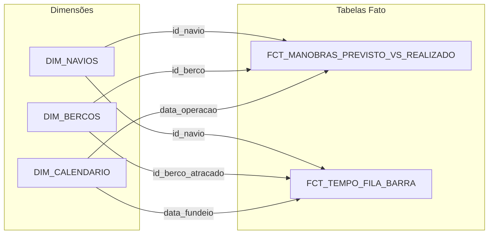

# 📚 Catálogo e Dicionário de Dados - Marítimo Data Pipeline

Este documento é a referência oficial da modelagem e arquitetura de dados do pipeline marítimo, detalhando os esquemas, tipos de dados, regras de negócio e linhagem das camadas **Silver** e **Gold**.

***

## ⚓ Glossário de Siglas e Termos Marítimos

* **ATB (*Actual Time of Berthing*):** Horário real em que a embarcação atracou no berço.

* **ATS (*Actual Time of Sailing*):** Horário real em que a embarcação desatracou e zarpou.

* **ETS (*Estimated Time of Sailing*):** Previsão estimada de saída do navio.

* **BB (*Bombordo*):** Lado esquerdo da embarcação (em relação à proa/frente).

* **BE (*Boreste*):** Lado direito da embarcação (em relação à proa/frente).

* **LOA (*Length Overall*):** Comprimento total do navio, de proa a popa (em metros/centímetros).

* **BOCA (*Beam*):** Largura máxima da embarcação (em centímetros/metros).

* **CALADO (*Draft*):** Distância vertical entre a linha de flutuação e a quilha (fundo) do navio.

* **EK (*Even Keel*):** Calado nivelado (calado de proa igual ao de popa).

* **TBC (*To Be Confirmed*):** Informação ainda a ser confirmada pelo armador/praticagem (muito comum em eventos climáticos/barra fechada).

***

# 🔘 PARTE 1: CAMADA SILVER (Snapshots Tratados)

## &#x20;Informações Gerais da Camada Silver

* **Formato de Armazenamento:** Apache Parquet

* **Frequência de Extração:** 4 vezes ao dia (aproximadamente às 07h, 12h, 16h e 18h).

* **Padrão de Nomenclatura dos Arquivos:** `YYYY-MM-DD_HH-MM-SS.parquet`

* **Metadados de Linhagem (Audit Columns) presentes em todas as tabelas:**

  * `data_processamento` (`datetime64[us]`): Timestamp exato em que o arquivo foi transformado pelo script `transform_silver.py`.

  * `arquivo_origem` (`string`): Nome do arquivo HTML bruto na `landing_raw` de onde o dado se originou.

  * `snapshot_timestamp` (`datetime64[us]`): Timestamp do snapshot extraído do nome do arquivo.

***

### 1.1 Tabela Silver: `manobras_previstas`

* **Descrição:** Registra a programação e status das manobras de entrada, saída e movimentação de navios previstas para os berços.

* **Granularidade:** Uma linha por manobra programada em um snapshot específico.

| Coluna                       | Tipo Pandas      | Tipo Parquet | Nulo? | Descrição                               | Exemplo / Regras                                       |
| :--------------------------- | :--------------- | :----------- | :---- | :-------------------------------------- | :----------------------------------------------------- |
| `data`                       | `datetime64[us]` | `TIMESTAMP`  | Não   | Data da manobra                         | `2026-08-27`                                           |
| `horario`                    | `string`         | `STRING`     | Não   | Texto original do horário e status      | `"16:45 atb"`, `"tbc"`                                 |
| `manobra`                    | `string`         | `STRING`     | Não   | Tipo da operação prevista               | `"entrada"`, `"saida"`, `"remocao"`                    |
| `berco`                      | `string`         | `STRING`     | Não   | Berço de destino/origem da atracação    | `"pnave 02"`, `"jbs 1"`                                |
| `bordo`                      | `string`         | `STRING`     | Sim   | Lado do navio atracado ao cais          | `"bb"` (bombordo), `"be"` (boreste)                    |
| `navio`                      | `string`         | `STRING`     | Não   | Nome do navio normalizado               | `"cosco shipping mexico"`                              |
| `rota`                       | `string`         | `STRING`     | Sim   | Rota/Bacia de evolução utilizada        | `"bacia 1"`, `"bacia 2"`                               |
| `loa`                        | `Int64`          | `INT64`      | Sim   | Comprimento total da embarcação (*LOA*) | `33590`                                                |
| `boca`                       | `Int64`          | `INT64`      | Sim   | Largura máxima da embarcação (*Beam*)   | `5100`                                                 |
| `calado`                     | `string`         | `STRING`     | Sim   | Medida do calado na manobra             | `"11,20 ek"`, `"9,15/10,50"`                           |
| `situacao`                   | `string`         | `STRING`     | Sim   | Situação operacional do navio           | `"no canal"`, `"atracado"`, `"fundeado"`, `"drifting"` |
| `hora`                       | `string`         | `STRING`     | Sim   | Horário previsto isolado (HH:MM)        | `"16:45"`, `<NA>` quando TBC                           |
| `status`                     | `string`         | `STRING`     | Sim   | Sigla do status operacional             | `"atb"`, `"ets"`, `"ats"`, `"tbc"`                     |
| `data_hora_manobra_prevista` | `datetime64[us]` | `TIMESTAMP`  | Sim   | Timestamp unificado (`data + hora`)     | `2026-08-27 16:45:00`, `NaT` quando TBC                |
| `data_processamento`         | `datetime64[us]` | `TIMESTAMP`  | Não   | Timestamp de ingestão/transformação     | `2026-08-27 22:51:35`                                  |
| `arquivo_origem`             | `string`         | `STRING`     | Não   | Arquivo HTML de origem                  | `"2026-08-27_18-00-06_manobras_previstas.html"`        |
| `snapshot_timestamp`         | `datetime64[us]` | `TIMESTAMP`  | Não   | Data/hora do snapshot extraído          | `2026-08-27 18:00:06`                                  |

***

### 1.2 Tabela Silver: `manobras_realizadas`

* **Descrição:** Registra o histórico das manobras efetivamente executadas no porto, incluindo rebocadores utilizados.

* **Granularidade:** Uma linha por manobra realizada em um snapshot específico.

| Coluna                        | Tipo Pandas      | Tipo Parquet | Nulo? | Descrição                            | Exemplo / Regras                                 |
| :---------------------------- | :--------------- | :----------- | :---- | :----------------------------------- | :----------------------------------------------- |
| `data`                        | `datetime64[us]` | `TIMESTAMP`  | Não   | Data em que a manobra foi realizada  | `2026-08-27`                                     |
| `navio`                       | `string`         | `STRING`     | Não   | Nome do navio normalizado            | `"maersk pangani"`                               |
| `manobra`                     | `string`         | `STRING`     | Não   | Tipo da operação executada           | `"entrada"`, `"saida"`                           |
| `berco`                       | `string`         | `STRING`     | Não   | Berço onde a manobra foi concluída   | `"jbs 1"`, `"pnave 01"`                          |
| `loa`                         | `Int64`          | `INT64`      | Sim   | Comprimento total da embarcação      | `23780`                                          |
| `boca`                        | `Int64`          | `INT64`      | Sim   | Largura máxima da embarcação         | `3879`                                           |
| `horario`                     | `string`         | `STRING`     | Não   | Texto original do horário e status   | `"15:15 atb"`                                    |
| `calado`                      | `string`         | `STRING`     | Sim   | Calado da embarcação na operação     | `"11,80 ek"`                                     |
| `rota`                        | `string`         | `STRING`     | Sim   | Rota de navegação interna            | `"bacia 2"`                                      |
| `bordo`                       | `string`         | `STRING`     | Sim   | Lado atracado                        | `"bb"`, `"be"`                                   |
| `rebocadores`                 | `string`         | `STRING`     | Sim   | Rebocadores que auxiliaram a manobra | `"aries/renaud"`                                 |
| `hora`                        | `string`         | `STRING`     | Sim   | Horário de conclusão isolado (HH:MM) | `"15:15"`                                        |
| `status`                      | `string`         | `STRING`     | Sim   | Sigla do status                      | `"atb"`, `"ats"`                                 |
| `data_hora_manobra_realizada` | `datetime64[us]` | `TIMESTAMP`  | Sim   | Timestamp unificado (`data + hora`)  | `2026-08-27 15:15:00`                            |
| `data_processamento`          | `datetime64[us]` | `TIMESTAMP`  | Não   | Timestamp de ingestão                | `2026-08-27 22:51:35`                            |
| `arquivo_origem`              | `string`         | `STRING`     | Não   | Arquivo HTML de origem               | `"2026-08-27_18-00-06_manobras_realizadas.html"` |
| `snapshot_timestamp`          | `datetime64[us]` | `TIMESTAMP`  | Não   | Data/hora do snapshot                | `2026-08-27 18:00:06`                            |

***

### 1.3 Tabela Silver: `navios_atracados`

* **Descrição:** Registra a foto operacional de quais navios estavam atracados nos berços no momento do snapshot.

* **Granularidade:** Uma linha por navio atracado em um snapshot.

| Coluna                | Tipo Pandas      | Tipo Parquet | Nulo? | Descrição                          | Exemplo / Regras                              |
| :-------------------- | :--------------- | :----------- | :---- | :--------------------------------- | :-------------------------------------------- |
| `berco`               | `string`         | `STRING`     | Não   | Berço de atracação                 | `"jbs 1"`, `"teporti"`                        |
| `bordo`               | `string`         | `STRING`     | Sim   | Lado atracado                      | `"bb"`, `"be"`                                |
| `navio`               | `string`         | `STRING`     | Não   | Nome do navio atracado             | `"maersk pangani"`                            |
| `rota`                | `string`         | `STRING`     | Sim   | Rota de navegação                  | `"bacia 1"`                                   |
| `data_hora_atracagem` | `datetime64[us]` | `TIMESTAMP`  | Sim   | Data e hora em que o navio atracou | `2026-08-27 17:12:00`                         |
| `situacao`            | `string`         | `STRING`     | Não   | Situação operacional do navio      | `"atracado"`                                  |
| `data_processamento`  | `datetime64[us]` | `TIMESTAMP`  | Não   | Timestamp de ingestão              | `2026-08-27 22:51:35`                         |
| `arquivo_origem`      | `string`         | `STRING`     | Não   | Arquivo HTML de origem             | `"2026-08-27_18-00-06_navios_atracados.html"` |
| `snapshot_timestamp`  | `datetime64[us]` | `TIMESTAMP`  | Não   | Data/hora do snapshot              | `2026-08-27 18:00:06`                         |

***

### 1.4 Tabela Silver: `navios_fundeados`

* **Descrição:** Registra os navios que estão aguardando na área de fundeio (barra externa) antes de atracar.

* **Granularidade:** Uma linha por navio fundeado no momento do snapshot.

| Coluna               | Tipo Pandas      | Tipo Parquet | Nulo? | Descrição                                    | Exemplo / Regras                              |
| :------------------- | :--------------- | :----------- | :---- | :------------------------------------------- | :-------------------------------------------- |
| `navio`              | `string`         | `STRING`     | Não   | Nome do navio fundeado                       | `"agios porfyrios"`                           |
| `loa`                | `string`         | `STRING`     | Sim   | Comprimento total da embarcação              | `"15515"`                                     |
| `posicao`            | `string`         | `STRING`     | Sim   | Coordenadas geográficas do ponto de fundeio  | `"26 52,64 s / 048 31,29 w"`                  |
| `calado`             | `string`         | `STRING`     | Sim   | Calado informado na barra                    | `"3,67/5,11"`                                 |
| `rota`               | `string`         | `STRING`     | Sim   | Rota de navegação                            | `null`                                        |
| `data_hora_fundeado` | `datetime64[us]` | `TIMESTAMP`  | Sim   | Data e hora em que o navio entrou em fundeio | `2026-08-15 22:09:00`                         |
| `situacao`           | `string`         | `STRING`     | Não   | Situação operacional do navio                | `"fundeado"`                                  |
| `data_processamento` | `datetime64[us]` | `TIMESTAMP`  | Não   | Timestamp de ingestão                        | `2026-08-27 22:51:35`                         |
| `arquivo_origem`     | `string`         | `STRING`     | Não   | Arquivo HTML de origem                       | `"2026-08-27_18-00-06_navios_fundeados.html"` |
| `snapshot_timestamp` | `datetime64[us]` | `TIMESTAMP`  | Não   | Data/hora do snapshot                        | `2026-08-27 18:00:06`                         |

***

### 1.5 Tabela Silver: `navios_previstos`

* **Descrição:** Registra a lista de navios esperados para chegar ao porto nos próximos dias (previsão de longo/médio prazo).

* **Granularidade:** Uma linha por navio esperado no momento do snapshot.

| Coluna                          | Tipo Pandas      | Tipo Parquet | Nulo? | Descrição                           | Exemplo / Regras                              |
| :------------------------------ | :--------------- | :----------- | :---- | :---------------------------------- | :-------------------------------------------- |
| `navio`                         | `string`         | `STRING`     | Não   | Nome do navio previsto              | `"msc barcelona vi"`                          |
| `loa`                           | `string`         | `STRING`     | Sim   | Comprimento total do navio          | `"27040"`                                     |
| `calado`                        | `string`         | `STRING`     | Sim   | Calado estimado                     | `"tbc"` (*to be confirmed*), `"10,50"`        |
| `rota`                          | `string`         | `STRING`     | Sim   | Rota esperada                       | `null`                                        |
| `data_hora_previsao_de_chegada` | `datetime64[us]` | `TIMESTAMP`  | Sim   | Data e hora estimada para a chegada | `2026-08-29 02:00:00`                         |
| `rebocadores`                   | `string`         | `STRING`     | Sim   | Rebocadores previstos               | `null`                                        |
| `situacao`                      | `string`         | `STRING`     | Não   | Situação operacional do navio       | `"chegada_prevista"`                          |
| `data_processamento`            | `datetime64[us]` | `TIMESTAMP`  | Não   | Timestamp de ingestão               | `2026-08-27 22:51:35`                         |
| `arquivo_origem`                | `string`         | `STRING`     | Não   | Arquivo HTML de origem              | `"2026-08-27_18-00-06_navios_previstos.html"` |
| `snapshot_timestamp`            | `datetime64[us]` | `TIMESTAMP`  | Não   | Data/hora do snapshot               | `2026-08-27 18:00:06`                         |

***

# 🟡 PARTE 2: CAMADA GOLD (Modelagem Dimensional - Star Schema)

## 🏛️ Informações Gerais da Camada Gold

* **Script de Geração:** `transform_gold.py`

* **Formato de Armazenamento:** Apache Parquet (armazenado em `gold/*.parquet`)

* **Modelo Analítico:** Star Schema (Esquema Estrela) otimizado para Qlik Sense, Qlik Cloud e Power BI.

* **Propósito:** Elimina duplicidades de múltiplos snapshots da Silver, calcula métricas de atraso/pontualidade (SLA), mede tempos de espera na barra e classifica operadores portuários.

***

### 2.1 Tabela Dimensão: `dim_navios`

* **Descrição:** Cadastro mestre e único de todas as embarcações que operam ou passaram pelo porto.

* **Granularidade:** Uma linha por navio único (`id_navio`).

* **Regra de Construção:** Consolida os navios de todas as 5 tabelas da Silver, ordenando pelo `snapshot_timestamp DESC` para reter o registro mais recente com `loa_metros` e `boca_metros` preenchidos.

| Coluna               | Tipo Pandas      | Tipo Parquet | Nulo? | Chave  | Descrição e Regra de Negócio                                                         |
| :------------------- | :--------------- | :----------- | :---- | :----- | :----------------------------------------------------------------------------------- |
| `id_navio`           | `string`         | `STRING`     | Não   | **PK** | Identificador único do navio em formato texto minúsculo normalizado.                 |
| `nome_navio`         | `string`         | `STRING`     | Não   | —      | Nome do navio em letras maiúsculas para exibição visual nos dashboards.              |
| `loa_metros`         | `Int64`          | `INT64`      | Sim   | —      | Comprimento total da embarcação (*Length Overall*) convertido para numérico inteiro. |
| `boca_metros`        | `Int64`          | `INT64`      | Sim   | —      | Largura máxima da embarcação (*Beam*) convertida para numérico inteiro.              |
| `data_processamento` | `datetime64[us]` | `TIMESTAMP`  | Não   | —      | Data e hora em que a dimensão foi processada.                                        |

***

### 2.2 Tabela Dimensão: `dim_bercos`

* **Descrição:** Cadastro de todos os berços portuários operacionais com mapeamento do Terminal Operador.

* **Granularidade:** Uma linha por berço (`id_berco`).

* **Regra de Construção:** Extrai a lista distinta de berços e aplica regras de classificação de texto para identificar o operador portuário.

| Coluna               | Tipo Pandas      | Tipo Parquet | Nulo? | Chave  | Descrição e Regra de Negócio                                                                                                                                                                    |
| :------------------- | :--------------- | :----------- | :---- | :----- | :---------------------------------------------------------------------------------------------------------------------------------------------------------------------------------------------- |
| `id_berco`           | `string`         | `STRING`     | Não   | **PK** | Código do berço normalizado (ex: `"pnave 01"`, `"jbs 2"`).                                                                                                                                      |
| `nome_berco`         | `string`         | `STRING`     | Não   | —      | Nome do berço em letras maiúsculas para exibição nos relatórios.                                                                                                                                |
| `terminal_operador`  | `string`         | `STRING`     | Não   | —      | Terminal responsável (`"Portonave"`, `"JBS / Terminais"`, `"Teporti"`, `"Braskarne"`, `"Poly Terminais"`, `"Barra do Rio"`, `"Navship"`, `"Brasil Sul"`, `"TPT"` ou `"Outros / Cais Público"`). |
| `data_processamento` | `datetime64[us]` | `TIMESTAMP`  | Não   | —      | Data e hora de processamento da dimensão.                                                                                                                                                       |

***

### 2.3 Tabela Dimensão: `dim_calendario`

* **Descrição:** Dimensão de tempo contínua para facilitar inteligência temporal (Time Intelligence), filtros por ano, mês, trimestre e dia da semana.

* **Granularidade:** Uma linha por dia do calendário (`data`).

* **Regra de Construção:** Gera automaticamente o intervalo diário completo com base nas datas mínimas e máximas encontradas nas operações.

| Coluna               | Tipo Pandas      | Tipo Parquet | Nulo? | Chave  | Descrição e Regra de Negócio                                            |
| :------------------- | :--------------- | :----------- | :---- | :----- | :---------------------------------------------------------------------- |
| `data`               | `datetime64[us]` | `TIMESTAMP`  | Não   | **PK** | Data completa no formato `YYYY-MM-DD`.                                  |
| `id_data`            | `int64`          | `INT64`      | Não   | —      | Chave inteira no formato `YYYYMMDD` (ex: `20260827`).                   |
| `ano`                | `int32`          | `INT32`      | Não   | —      | Ano numérico (ex: `2026`).                                              |
| `mes`                | `int32`          | `INT32`      | Não   | —      | Mês numérico de 1 a 12.                                                 |
| `dia`                | `int32`          | `INT32`      | Não   | —      | Dia do mês de 1 a 31.                                                   |
| `trimestre`          | `int32`          | `INT32`      | Não   | —      | Trimestre do ano (1 a 4).                                               |
| `semestre`           | `int64`          | `INT64`      | Não   | —      | Semestre do ano (1 ou 2).                                               |
| `dia_semana`         | `int32`          | `INT32`      | Não   | —      | Dia da semana numérico (1 = Segunda-feira até 7 = Domingo).             |
| `mes_nome`           | `string`         | `STRING`     | Não   | —      | Nome por extenso do mês em Português (ex: `"Agosto"`, `"Setembro"`).    |
| `dia_semana_nome`    | `string`         | `STRING`     | Não   | —      | Nome do dia da semana em Português (ex: `"Segunda-feira"`, `"Sábado"`). |
| `flag_fim_de_semana` | `bool`           | `BOOLEAN`    | Não   | —      | Booleano indicando se a data é Sábado ou Domingo (`True`/`False`).      |

***

### 2.4 Tabela Fato: `fct_manobras_previsto_vs_realizado`

* **Descrição:** Tabela fato central do pipeline marítimo. Cruza a última programação emitida de uma manobra com a sua realização física, apurando métricas de pontualidade, atrasos e uso de rebocadores.

* **Granularidade:** Uma linha por operação única de manobra (`data + navio + tipo_manobra + berco`).

* **Regra de Construção:**

  1. Deduplica `manobras_previstas` pegando a última previsão emitida antes da manobra (`snapshot_timestamp`).
  2. Deduplica `manobras_realizadas` mantendo o registro oficial de conclusão.
  3. Realiza `FULL OUTER JOIN` entre Previsão e Realização.
  4. Calcula o atraso em minutos e categoriza o status de pontualidade.

| Coluna                            | Tipo Pandas      | Tipo Parquet | Nulo? | Chave       | Descrição e Regra de Negócio                                                                                                                                                                                                                                                                                                                                                   |
| :-------------------------------- | :--------------- | :----------- | :---- | :---------- | :----------------------------------------------------------------------------------------------------------------------------------------------------------------------------------------------------------------------------------------------------------------------------------------------------------------------------------------------------------------------------- |
| `id_operacao`                     | `string`         | `STRING`     | Não   | **PK**      | Chave composta única da operação: `{data}_{navio}_{tipo_manobra}_{berco}`.                                                                                                                                                                                                                                                                                                     |
| `data_operacao`                   | `datetime64[us]` | `TIMESTAMP`  | Não   | **FK**      | Data em que a manobra estava prevista ou foi realizada (relaciona com `dim_calendario.data`).                                                                                                                                                                                                                                                                                  |
| `id_navio`                        | `string`         | `STRING`     | Não   | **FK**      | Código do navio (relaciona com `dim_navios.id_navio`).                                                                                                                                                                                                                                                                                                                         |
| `id_berco`                        | `string`         | `STRING`     | Não   | **FK**      | Código do berço da manobra (relaciona com `dim_bercos.id_berco`).                                                                                                                                                                                                                                                                                                              |
| `tipo_manobra`                    | `string`         | `STRING`     | Não   | —           | Tipo de manobra (`"entrada"`, `"saida"`, `"remocao"`).                                                                                                                                                                                                                                                                                                                         |
| `bordo`                           | `string`         | `STRING`     | Sim   | —           | Lado atracado ao cais consolidado (`"bb"` para bombordo, `"be"` para boreste).                                                                                                                                                                                                                                                                                                 |
| `rota`                            | `string`         | `STRING`     | Sim   | —           | Rota/Bacia de evolução utilizada (`"bacia 1"`, `"bacia 2"`).                                                                                                                                                                                                                                                                                                                   |
| `data_hora_manobra_prevista`      | `datetime64[us]` | `TIMESTAMP`  | Sim   | —           | Data e hora agendada pela última previsão emitida.                                                                                                                                                                                                                                                                                                                             |
| `data_hora_manobra_realizada`     | `datetime64[us]` | `TIMESTAMP`  | Sim   | —           | Data e hora em que a manobra foi efetivamente concluída pelo prático.                                                                                                                                                                                                                                                                                                          |
| `diferenca_minutos_atraso`        | `float64`        | `DOUBLE`     | Sim   | **MÉTRICA** | Diferença em minutos entre a realização e a previsão (`Realizado - Previsto`). Valores positivos indicam atraso; negativos indicam adiantamento.                                                                                                                                                                                                                               |
| `status_pontualidade`             | `string`         | `STRING`     | Não   | —           | Classificação analítica de SLA: • **`"No Prazo"`**: desvio entre -30 e +30 min.• **`"Atrasado"`**: desvio > +30 min.• **`"Adiantado"`**: desvio < -30 min.• **`"Horario Suspenso / TBC"`**: dias de barra fechada/sem horário definido.• **`"Realizado Sem Previsao"`**: manobra concluída sem aviso prévio.• **`"Previsto Nao Realizado"`**: manobra cancelada/não executada. |
| `rebocadores`                     | `string`         | `STRING`     | Sim   | —           | String original com o nome dos rebocadores que apoiaram a manobra (ex: `"aries/renaud"`).                                                                                                                                                                                                                                                                                      |
| `qtd_rebocadores`                 | `Int64`          | `INT64`      | Não   | **MÉTRICA** | Contagem total de rebocadores empregados na manobra (calculado a partir da contagem de elementos separados por barra).                                                                                                                                                                                                                                                         |
| `status_previsao`                 | `string`         | `STRING`     | Sim   | —           | Status original da previsão (`"atb"`, `"ets"`, `"ats"`, `"tbc"`).                                                                                                                                                                                                                                                                                                              |
| `situacao_navio_previsao`         | `string`         | `STRING`     | Sim   | —           | Localização do navio no momento da previsão (`"fundeado"`, `"drifting"`, `"no canal"`, `"atracado"`).                                                                                                                                                                                                                                                                          |
| `status_realizado`                | `string`         | `STRING`     | Sim   | —           | Status no momento da conclusão real (`"atb"`, `"ats"`).                                                                                                                                                                                                                                                                                                                        |
| `horas_antecedencia_previsao`     | `float64`        | `DOUBLE`     | Sim   | **MÉTRICA** | Horas de antecedência com que a última previsão foi publicada antes da realização real do evento.                                                                                                                                                                                                                                                                              |
| `timestamp_ultima_previsao`       | `datetime64[us]` | `TIMESTAMP`  | Sim   | —           | Momento do snapshot do qual foi extraída a previsão mais recente.                                                                                                                                                                                                                                                                                                              |
| `timestamp_confirmacao_realizada` | `datetime64[us]` | `TIMESTAMP`  | Sim   | —           | Momento do snapshot em que a conclusão da manobra foi detectada.                                                                                                                                                                                                                                                                                                               |
| `data_processamento`              | `datetime64[us]` | `TIMESTAMP`  | Não   | —           | Timestamp em que a linha fato foi calculada.                                                                                                                                                                                                                                                                                                                                   |

***

### 2.5 Tabela Fato: `fct_tempo_fila_barra`

* **Descrição:** Mede a eficiência de acesso ao porto, registrando o tempo de espera (em horas) desde a chegada do navio na área de fundeio (barra externa) até sua efetiva atracação em um berço.

* **Granularidade:** Uma linha por ciclo de espera de fundeio de um navio (`id_espera`).

* **Regra de Construção:**

  1. Identifica cada entrada única de um navio na tabela `navios_fundeados` (`data_hora_fundeado`).
  2. Localiza em `navios_atracados` a primeira atracação desse navio com timestamp maior ou igual à data de fundeio.
  3. Calcula o tempo de espera em horas: $(\text{data\_hora\_atracagem} - \text{data\_hora\_fundeado}) / 3600$.

| Coluna                | Tipo Pandas      | Tipo Parquet | Nulo? | Chave       | Descrição e Regra de Negócio                                                                                |
| :-------------------- | :--------------- | :----------- | :---- | :---------- | :---------------------------------------------------------------------------------------------------------- |
| `id_espera`           | `string`         | `STRING`     | Não   | **PK**      | Identificador único do ciclo de fundeio: `{navio}_{YYYYMMDD_HHMM}`.                                         |
| `id_navio`            | `string`         | `STRING`     | Não   | **FK**      | Código do navio (relaciona com `dim_navios.id_navio`).                                                      |
| `data_fundeio`        | `datetime64[us]` | `TIMESTAMP`  | Não   | **FK**      | Data em que o navio ancorou na barra (relaciona com `dim_calendario.data`).                                 |
| `data_hora_fundeado`  | `datetime64[us]` | `TIMESTAMP`  | Não   | —           | Data e hora exata em que o navio entrou na fila de fundeio.                                                 |
| `data_hora_atracagem` | `datetime64[us]` | `TIMESTAMP`  | Sim   | —           | Data e hora em que o navio conseguiu atracar no berço (nulo enquanto aguarda na fila).                      |
| `tempo_espera_horas`  | `float64`        | `DOUBLE`     | Sim   | **MÉTRICA** | Total de horas de espera na barra até a atracação.                                                          |
| `status_espera`       | `string`         | `STRING`     | Não   | —           | Situação do ciclo: `"Atracado com Sucesso"` ou `"Aguardando na Barra (Fundeado)"`.                          |
| `id_berco_atracado`   | `string`         | `STRING`     | Sim   | **FK**      | Berço no qual o navio atracou após sair do fundeio (relaciona com `dim_bercos.id_berco`).                   |
| `posicao_barra`       | `string`         | `STRING`     | Sim   | —           | Coordenadas geográficas de fundeio informadas pela autoridade portuária (ex: `"26 52,64 s / 048 31,29 w"`). |
| `data_processamento`  | `datetime64[us]` | `TIMESTAMP`  | Não   | —           | Data e hora de processamento da tabela.                                                                     |
