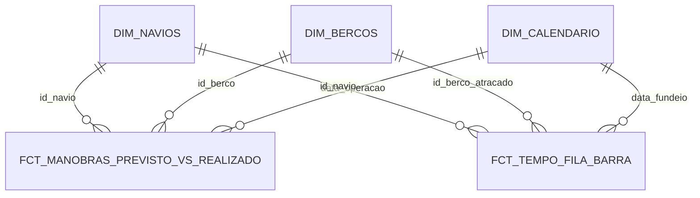
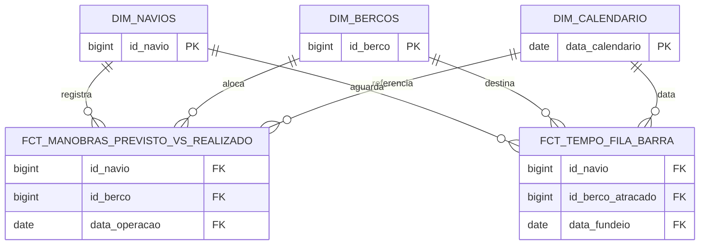
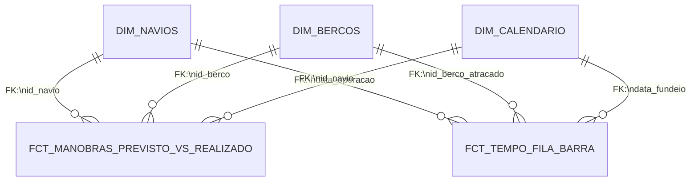
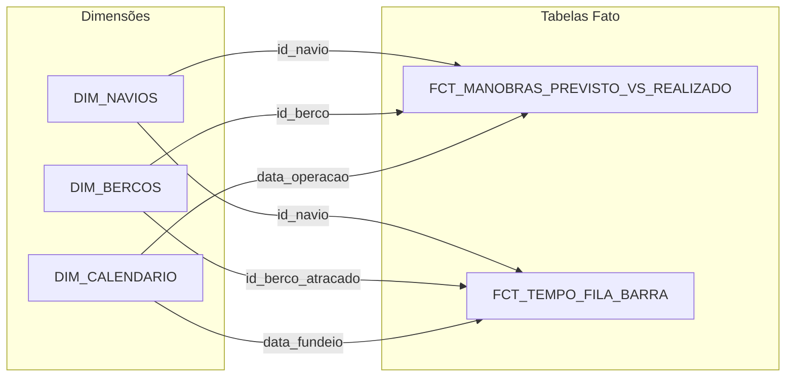

```mermaid
erDiagram
    DIM_NAVIOS ||--o{ FCT_MANOBRAS_PREVISTO_VS_REALIZADO : id_navio
    DIM_BERCOS ||--o{ FCT_MANOBRAS_PREVISTO_VS_REALIZADO : id_berco
    DIM_CALENDARIO ||--o{ FCT_MANOBRAS_PREVISTO_VS_REALIZADO : data_operacao

    DIM_NAVIOS ||--o{ FCT_TEMPO_FILA_BARRA : id_navio
    DIM_BERCOS ||--o{ FCT_TEMPO_FILA_BARRA : id_berco_atracado
    DIM_CALENDARIO ||--o{ FCT_TEMPO_FILA_BARRA : data_fundeio
```

```mermaid
erDiagram
    DIM_NAVIOS {
        bigint id_navio PK
    }
    DIM_BERCOS {
        bigint id_berco PK
    }
    DIM_CALENDARIO {
        date data_calendario PK
    }

    FCT_MANOBRAS_PREVISTO_VS_REALIZADO {
        bigint id_navio FK
        bigint id_berco FK
        date data_operacao FK
    }

    FCT_TEMPO_FILA_BARRA {
        bigint id_navio FK
        bigint id_berco_atracado FK
        date data_fundeio FK
    }

    DIM_NAVIOS ||--o{ FCT_MANOBRAS_PREVISTO_VS_REALIZADO : registra
    DIM_BERCOS ||--o{ FCT_MANOBRAS_PREVISTO_VS_REALIZADO : aloca
    DIM_CALENDARIO ||--o{ FCT_MANOBRAS_PREVISTO_VS_REALIZADO : referencia

    DIM_NAVIOS ||--o{ FCT_TEMPO_FILA_BARRA : aguarda
    DIM_BERCOS ||--o{ FCT_TEMPO_FILA_BARRA : destina
    DIM_CALENDARIO ||--o{ FCT_TEMPO_FILA_BARRA : data
```

```mermaid
erDiagram
    DIM_NAVIOS ||--o{ FCT_MANOBRAS_PREVISTO_VS_REALIZADO : "id_navio"
    DIM_NAVIOS ||--o{ FCT_TEMPO_FILA_BARRA : "id_navio"

    DIM_BERCOS ||--o{ FCT_MANOBRAS_PREVISTO_VS_REALIZADO : "id_berco"
    DIM_BERCOS ||--o{ FCT_TEMPO_FILA_BARRA : "id_berco_atracado"

    DIM_CALENDARIO ||--o{ FCT_MANOBRAS_PREVISTO_VS_REALIZADO : "data_operacao"
    DIM_CALENDARIO ||--o{ FCT_TEMPO_FILA_BARRA : "data_fundeio"
```

```mermaid
erDiagram
    DIM_NAVIOS ||--o{ FCT_MANOBRAS_PREVISTO_VS_REALIZADO : "FK:\nid_navio"
    DIM_BERCOS ||--o{ FCT_MANOBRAS_PREVISTO_VS_REALIZADO : "FK:\nid_berco"
    DIM_CALENDARIO ||--o{ FCT_MANOBRAS_PREVISTO_VS_REALIZADO : "FK:\ndata_operacao"

    DIM_NAVIOS ||--o{ FCT_TEMPO_FILA_BARRA : "FK:\nid_navio"
    DIM_BERCOS ||--o{ FCT_TEMPO_FILA_BARRA : "FK:\nid_berco_atracado"
    DIM_CALENDARIO ||--o{ FCT_TEMPO_FILA_BARRA : "FK:\ndata_fundeio"
```

```mermaid
flowchart LR
    subgraph Dimensoes["Dimensões"]
        DIM_NAVIOS["DIM_NAVIOS"]
        DIM_BERCOS["DIM_BERCOS"]
        DIM_CALENDARIO["DIM_CALENDARIO"]
    end

    subgraph Fatos["Tabelas Fato"]
        FCT_MANOBRAS["FCT_MANOBRAS_PREVISTO_VS_REALIZADO"]
        FCT_FILA["FCT_TEMPO_FILA_BARRA"]
    end

    DIM_NAVIOS -->|id_navio| FCT_MANOBRAS
    DIM_BERCOS -->|id_berco| FCT_MANOBRAS
    DIM_CALENDARIO -->|data_operacao| FCT_MANOBRAS

    DIM_NAVIOS -->|id_navio| FCT_FILA
    DIM_BERCOS -->|id_berco_atracado| FCT_FILA
    DIM_CALENDARIO -->|data_fundeio| FCT_FILA
```